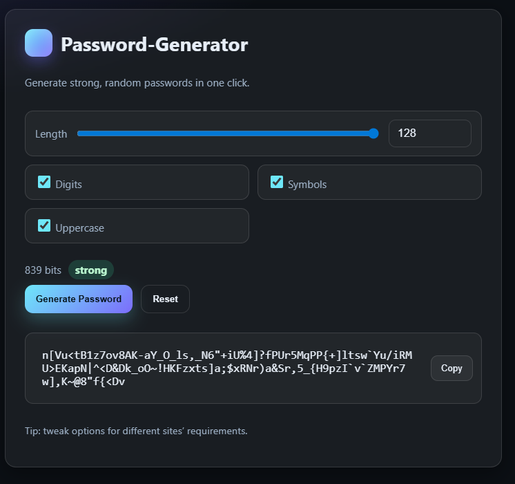

# Password Generator — Python + Node
[](https://github.com/s1natex/Docker_evo/actions/workflows/ci.yml)

A small microservice password generator with a python flask service and node+html UI
## Project Overview
- **Backend** — Python/Flask API that generates strong random passwords  
  Endpoints: `GET /health`, `GET /generate?length=…&digits=…&symbols=…&uppercase=…`
- **Frontend** — Node/Express server that serves the UI and proxies `GET /api/generate` to the backend
- Each service runs on a docker container, Build wrapped with docker compose translated to k8s yaml via kompose tool
- Deployed and Tested with Kubernetes in a custom namespace
- Validated with GitHub Actions CI

## Prerequisites
### A) Run with Docker Compose
- **Docker Desktop** (or Docker Engine) with **Compose v2**
  - Check: `docker --version` and `docker compose version`
- **Git** (to clone/pull)
  - Check: `git --version`
- **Open ports:** `3000` (frontend) and `5000` (backend) must be free

### B) Deploy with Kubernetes (Docker Desktop)
- **Docker Desktop’s Kubernetes** **enabled**  
  - Docker Desktop → Settings → Kubernetes → *Enable Kubernetes*
- **kubectl**
  - Check: `kubectl version --client`
- **Local images built** with Docker (same runtime as Docker Desktop)
  - Run: `docker compose build`

## Deployment
- **Clone** the Repository and **cd** to Repository directory
- **Docker compose:**
```
docker compose up --build -d
```
- **Kubernetes:**
```
kubectl apply -f k8s/namespace.yaml
kubectl apply -f k8s/serviceaccount.yaml
kubectl apply -f k8s/pass-gen-deployment.yaml
kubectl apply -f k8s/pass-gen-service.yaml
kubectl apply -f k8s/frontend-deployment.yaml
kubectl apply -f k8s/frontend-service-nodeport.yaml

# Check rollout
kubectl -n passgen-app rollout status deploy/pass-gen
kubectl -n passgen-app rollout status deploy/frontend
```

## Clean Up
- Docker Compose
```
docker compose down
```
- Kubernetes
```
kubectl delete namespace passgen-app --wait
```

## UI and Terminal validation
- Via compose: http://localhost:3000
- Via k8s: http://localhost:30080/

### [PassGen backend validation Commands](services/pass-gen/Validation.md)
  


- **Terminal commands:**
```
kubectl -n passgen-app port-forward svc/pass-gen 5000:5000 &
curl "http://localhost:5000/health"
curl "http://localhost:5000/generate?length=20"
```


## Features
- Cryptographically secure passwords using Python’s `secrets` module
- Options for length, digits, symbols, uppercase
- Clean Express proxy: frontend never calls containers directly by IP
- Fully containerized one-command up with Docker Compose
- CI: unit tests + build + smoke tests via GitHub Actions
- Kubernetes manifests
- Modern, centered UI
  
