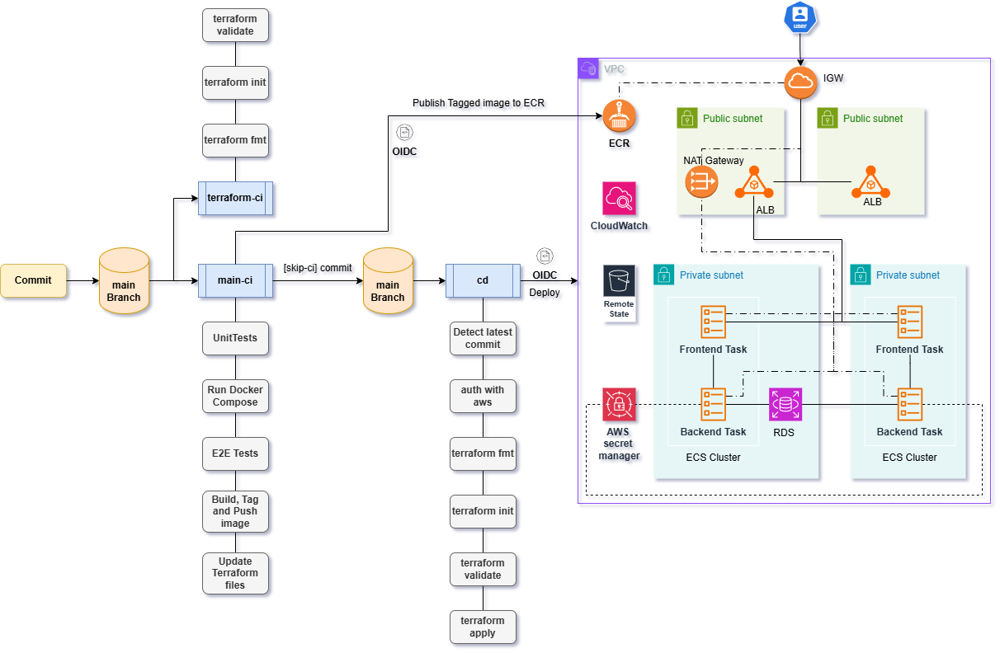

# Password Generator Microservice Webapp Deployment to ECS-Fargate with an E2E CI/CD

# [Project Page](https://roadmap.sh/projects/basic-dockerfile)
# Project Overview
- `Frontend`: React application UI for password generation and management, deployed on ECS using a Docker container
- `Backend`: Python Flask API handling password generation logic and database interactions, deployed on ECS using a Docker container
- `RDS database`: AWS RDS PostgreSQL instance storing user data securely, with credentials managed through AWS Secrets Manager
- `AWS VPC`: Custom virtual private cloud providing isolated networking for ECS, RDS, and other AWS resources
- `ECS Cluster`: AWS ECS cluster hosting both the frontend and backend services
- `ECS Services`: Two ECS services (frontend and backend) managing container deployment, scaling, and availability
- `ECS Tasks`: Definitions for running Docker containers in ECS with environment variables, IAM roles, and resource limits
- `ALB`: - AWS ALB routing incoming traffic to the correct ECS service based on configured target groups
- `Security Groups`: Network access control rules allowing traffic only between approved AWS components and ports
- `Cloudwatch Logs`: Centralized logging for ECS tasks, capturing both application and system logs
- `ECR`: Private AWS Elastic Container Registry repositories for storing built Docker images for frontend and backend
- `S3 Terraform State Bucket`: S3 bucket storing Terraform remote state files for infrastructure management
- `DynamoDB Terraform Lock Table`: DynamoDB table providing state locking to prevent concurrent Terraform operations
- `IAM Roles and Policies`: IAM roles for ECS tasks, Terraform, and GitHub Actions with least-privilege permissions
- `OIDC Provider for Github Actions`: enabling GitHub Actions to assume AWS roles without long-term credentials
- `Terraform Bootstrap`: Terraform setup that provisions backend resources (S3, DynamoDB, IAM, OIDC) for managing state and CI/CD access
- `Terraform ECS`: Terraform module managing application infrastructure such as ECS, networking, and ALB
- `Terraform CI`: Workflow for validating terraform configurations files
- `CI Workflow`: Workflow for building, testing, and pushing Docker images to ECR upon code changes
- `CD Workflow`: Workflow for automatically deploying new ECS task definitions after a successful CI run
- `AWS Secrets Manager`: Service used to securely store sensitive environment variables like database connection strings
# Instructions Links
[Setup and Testing on Local Docker-Compose](./docs/compose-deploy-test-clean.md)
[Setup and Testing on AWS ECS-Fargate](./docs/aws-ecs-startup.md)
# Project Diagram

# Screenshots

